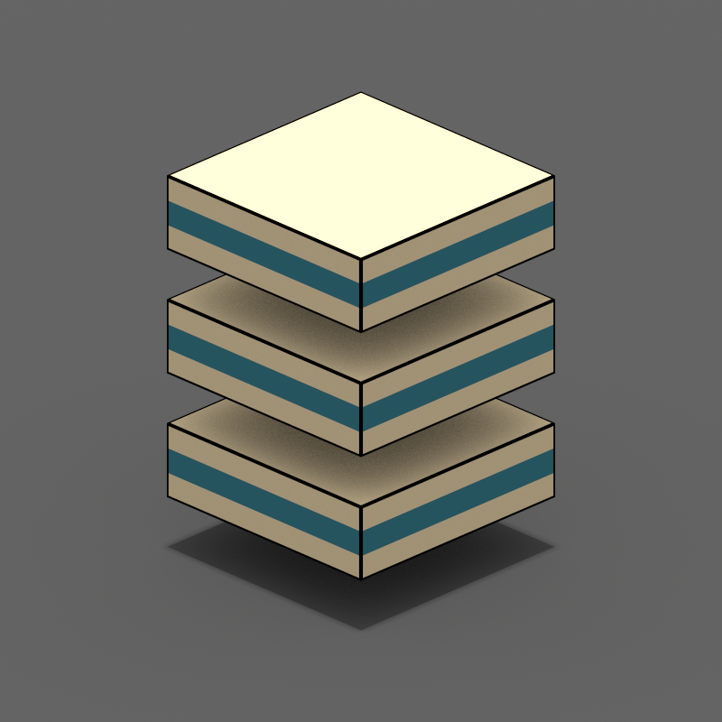

# Overview

This program takes in a `.csv` file describing layout of voxels on a given horizontal plane, and outputs a [MagicaVoxel](https://ephtracy.github.io/) shader file.

Compile the project or download executables then use command line to compile sources.

(Technical) This project doesn't deal with Magica Voxel native file formats except it generates shader source code; Refer to [MagicaVoxelWriter](https://github.com/chaojian-zhang/MagicaVoxelWriter) for direct manipulation of `.vox` format. This project in its current state is to be deprecated (also consider Zarbuz's [FileToVox](https://github.com/Zarbuz/FileToVox) as a more complete example). Pending effort implementing solutions for [MagicaVoxel Viewer](https://ephtracy.github.io/index.html?page=mv_renderer).

**Commands**

* `MagicaPlane folderpath rows columns height` (is this implemented?): Setup object folder, add corresponding filler cells and generate `.csv` files as a starting point (i.e. all cells filled with 'empty').

**Formats for Material Value**

Index of Color palette as you will use for Material property. Notice if a grid cell is empty, you need to specify null explicitly with index 0 (see example below).

# Usage

1. Draw your desired shapes in a sequence of *headless* `.csv` files to represent same-dimension layers for final voxel design, filling each cell a **target material name**; Those sequence files shall be named with numerical filenames, and will be ordered from lowest as bottom layers to highest as top layers, exact numerical values don't matter, only the relative order matters; See **sample layer** in **Reference** below.
2. Prepare a sepearte *headless* `.csv` file named `material.csv` which have two columns: **name**, and **value**, where "value" maps to index in the pallete (from `1`-`255`); See **sample material** in **Reference** below.
3. Put all those files in a common folder;
4. Execute MP and pass in folder path;
5. MP will generate a shader file for you to consume: you need to prepare the corresponding **cube dimension** and **clean the cube** before executing the shader.

# Notes

1. (Motivation, Background) MagicaVoxel is great for **visualization and rendering**, but there is one particular editing function that seems missing - **modify on reference/height planes**. (Reason) One might try to use custom editor then generate directly to `.vox` format but that doesn't work, or generate directly to `.schematic` format - that doesn't work as well (why?). One might expect to use only **MagicaVoxel View** - but none of the formats it supports seems to have any well-defined specification I can find. (Alternative) There is [FileToVox](https://github.com/Zarbuz/FileToVox) project (but that does seem very powerful?), which unfortunately contains too many advanced features for this simple task (they also seem to support CSV now, I am not sure at the point of me creating this repo did they have that support or not).
2. (Remark) This tool (was originally conceived to) converts sequence of same-dimension `.png` into a MagicaVoxel shader, which when executed can have the effect of generating a corresponding `.vox` object - thus allowing a **plane based editing** experience. But that is troublesome and require additional photo editing tools and coloring is troublesome, so instead we use *headless* `.csv` based approach.
3. (Todo, Feature) Naturally, to workaround the 126x126x126 size limit, we will support breaking the volumes down into seperate pieces.
4. (Todo, Future) Ideally we support better ways to exploit MagicaVoxel's `.vox` file format or **MagicaVoxel Viewer** more directly (e.g. support its *sparse oct tree* formats). I will create a tool that can export to MagicaVoxel Viewer supported formats.
5. (Future) Due to MagicaVoxel's lack of documentation, specification, and chunk based format design, ideally a more specialized alternative solution shall exist - or at least a dedicated **format converter**, but to compare with MagicaVoxel will require too much work. Also see [Block Bench](https://blockbench.net/) for voxel editing purpose. (Remark, Process) Work on components then do composition using translation and maybe scaling in main MagicaVoxel editor.
6. (Process) For basic editing use Sublime Text or Notepad++ both have good name highlight and replacement and good for line editing; For larger planes use Excel for column editing.
7. (Technical) Manually flip Y before rendering. This is due to layout (Y axis direction) difference and we intentionally don't flip it automatically so text definitions look as expected. Also notice each row in text definition maps to Y coordinate of voxel in MV, while each column in text definitions maps to X coordinate of voxel in MV.
8. (Documentation, Question, Management) Why two project folders, what are they for (differently)?
9. (Issue) This is a remaining Problem: due to lack of documentation, I don't even know the language format for **shader** file - does it support global variables, arrays, multi-dimension arrays? It looks like GL Shading language, per [here](https://github.com/CodingEric/Erics-MagicaVoxel-Shaders)? After some test, it turns out with this method (probably due to restriction of GLSL arrays) we can feed a maximum of **15x15x15** grid, and nothing more (what does that mean?)! (Todo) Again, pending using Magical Voxel Viewer (https://twitter.com/ephtracy/status/687051581859168256) - however that will compromise editing.
10. (TODO, Feature) Placement/Insertion function into project scene (for MagicaPlaneProject) - CSV based: with custom boundary from 0-255 for width length and height. Place any object from subfolders into master planes with automatic clamping. However master scene records only steps rather than CSVs directly - it saves insertion procedurals as a YAML list in `.scene` file. This makes it easier to iterate and modify by hand. During compilation process MPP will generate in memory and compile this file into corresponding shader and vox.
    * (Specification) Placement is anchor based: every cubical region has 27 anchors, and those are: (Top)T1-T9, and T5 is equivalent as TC (top center), (Middle)M1-M9, MC, (Bottom) B1-B9, BC. Numbering is clockwise.
    * (Feature) A separate program, called MagicaPlaneComposer can compose scenes as MagicaVoxel layers, supporting larger scale contents.
    * (Utility) A tool for generating result documentation purpose converts all 2D grid texts in CSVs for each plane into animated superpositioned gif image.
    * (Issue) Such text file based approach might not be suited for larger scale scenes due to lack of visualization.

# Terminology

To be consistent to MagicaVoxel, final terminology is defined here, code might still use old convention (e.g. use "layer" for "plane" for objects, and use "component" for object), pending updating code.

0. MP: MagivaPlane
0. MV: MagicaVoxel
0. MPP: MagicaPlaneProject
0. MPC: MagicaPlaneComposer
0. Voxel: A single 3D grid cell containing material name
1. Object: A custom max 15x15x15 (for shader editing) or 128x128x128 (for MagicaVixel editor) or 256x256x256 (for MagicaVoxel Viewer) size cubical video region. Notice for technical boundary reasons, objects may be only partial representation of what one actually needs to build, and several objects together are used to represent one complete object.
2. Scene: a custom size (max 256x256x256) placement of objects.
3. Composition: An arbitrary size (bound by 2048x2048x2048) placement of scenes.
4. Planes: Objects in MP are defined using planes of voxels layer by layer to form a complete object.
5. Layers: Scenes in compositions are managed using MagivaVoxel layers, which is actually a form of grouping and the term is borrowed from 2D photo editors which literally means layers of pixels but in this case it's a bit unfortunate because it no longer have literal meaning - now "plane" means layers of voxels and "layer" means groups of objects.
6. Project: An MP project manages objects in subfilders and generates and manages scene and composition files. A project can have many object subfolders, many scenes, but only one composition.

# Implementation

The basic mechanism for this is simple: a large const array will be defined for each `vec3` position of the volume, then inside `map()` function we will just sample from it.

Example:

```glsl
const float volume[5] = float[5](1, 2, 3, 4, 5);

float map(vec3 v) {
	int index = int(mod(v.x, 5));
	return volume[index];
}
```

# Reference

**Sample Layer**

Something like `1.csv` and `2.csv` defines a `5 (row) x 3(col) x 2 (height)` volume (which corresponds to a total of `5x3x2=30` values):

```csv
ground,ground,ground
ground,ground,ground
ground,ground,ground
ground,ground,ground
ground,ground,ground
```

```csv
empty,ground,empty
ground,ground,ground
ground,light,ground
ground,ground,ground
empty,ground,empty
```

**Sample Material**

`material.csv`:

```csv
empty, 0
ground,1
light,5
```

Other examples:

1. (Example) Logo (15 Planes each with size 10x10): Repeat WBW sandwich 3 times, with 2 planes as gap in between.
